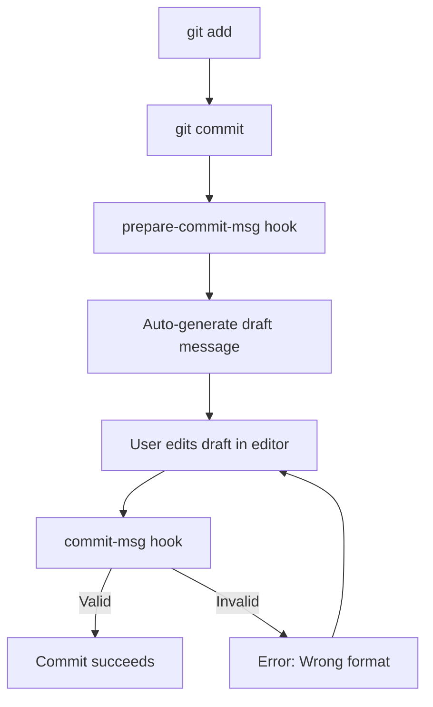

# Flow Commit Lazy



### How it works
1. **Prepare** – `prepare-commit-msg` hook reads the staged files.
2. **Draft** – It auto‑fills a commit message like `feat: update file1.py, file2.py`.
3. **Edit** – You just adjust the type (`feat`, `fix`, `docs`, `chore`, etc.) and add a short description.
4. **Validate** – `commit-msg` hook checks the message against the Conventional Commits pattern.

### Setup (run once per repository)
```bash
# Go to your project directory
cd ~/Documents/xxx/your-directory

# Create the hooks folder if it does not exist
mkdir -p githooks

# The two hook scripts are already placed in githooks/ (prepare-commit-msg & commit-msg)

# Make them executable and tell Git to use this folder for hooks
chmod +x githooks/prepare-commit-msg githooks/commit-msg
git config core.hooksPath githooks
```

### Usage (automatic)
After the setup, every time you run `git commit`:
1. `git add <files>`
2. `git commit`
   * Your editor opens with a draft commit message (e.g., `feat: update file1.py, file2.py`).
   * Edit the type if needed (`fix`, `chore`, …) and add a short description.
   * Save and close the editor.
3. The `commit-msg` hook validates the message.
   * If the format is correct, the commit is created.
   * If not, you receive an error and the editor opens again for correction.

Enjoy a consistent and hassle‑free commit workflow!